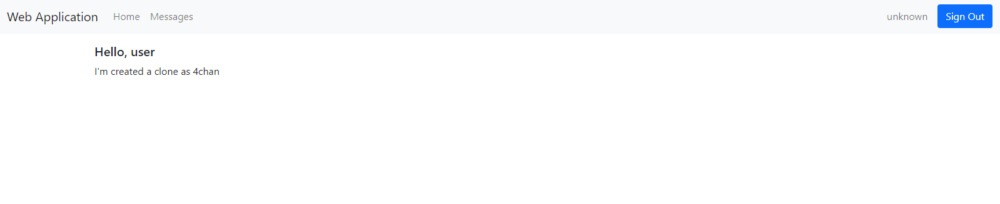
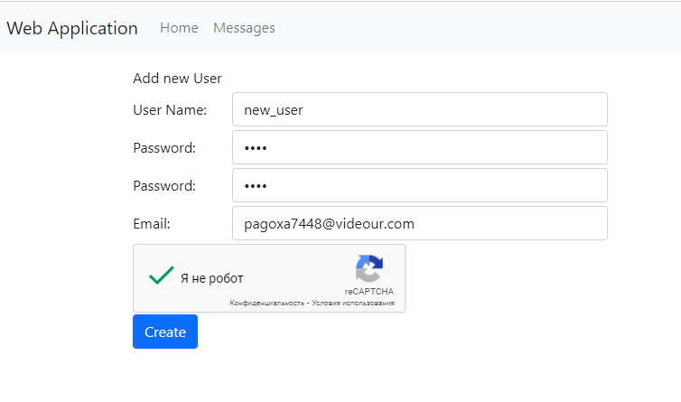
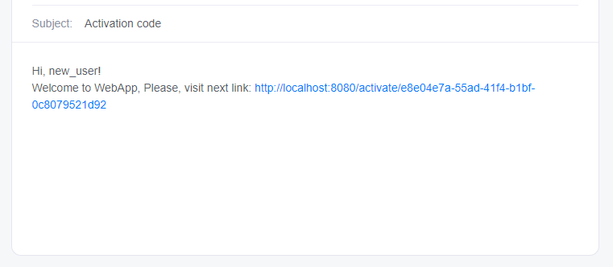
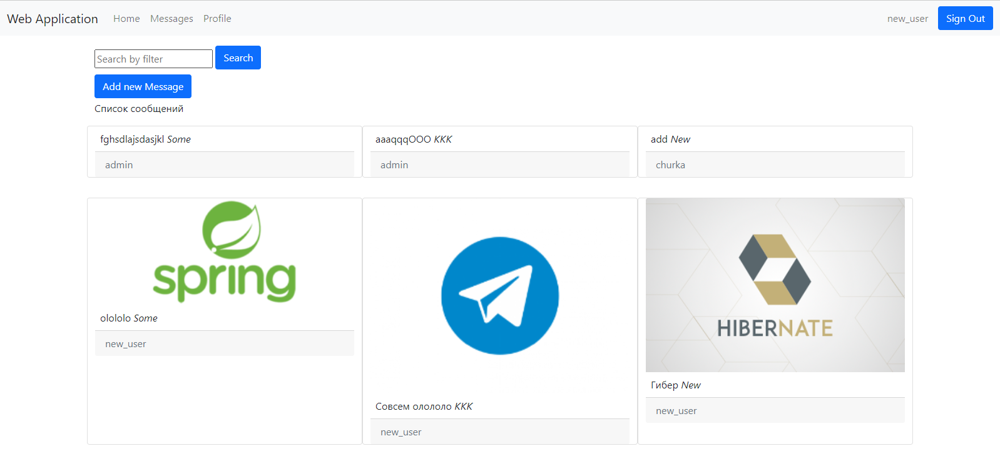
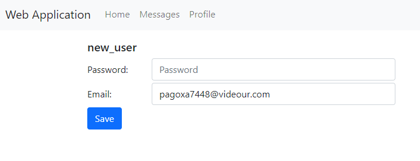
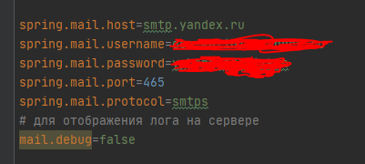

## Серверное приложение для публичного обмена сообщениями

  

#### **Серверная часть** реализована на **SpringBoot**  
#### FRONT чать приложения создана при помощи обработчика шаблонов **Freemarker** и фреймворка **Bootstrap**  
#### Используемая СУБД - **PostgreSQL**  

#### **Что делает приложение:**  
Пользователь **логиниться/регистрируется** в сервисе. Регистрация проходит с **подтверждением Email** пользователя и **reCaptcha-проверкой**.  

  

**Подтвверждение Email** происходит путем отправки пользователю с **почтового сервиса** сообщения на Email, в котором указана **ссылка для активации**, перейдя по которой пользователь установит флаг активации своей эл.почты.  

 

**Основная страница веб приложения:**  
Пользователи пишут сообщения для всех пользователей. При этом залогиненые пользователи видят **блоки сообщений**, в которых отображено само **сообщение**, **логин** отправителя, **тэг-категория** и прикрепленные **медиа-файлы**.  

  

Пользователь может **писать сообщение**, **указывать тег** сообщения и **загружать** к нему **медиа-файлы**, а также искать сообщения при помощи **фильтров**.  
Также пользователь может **изменить** свой **Email** и **пароль** от учетной записи.  

  

#### **Используемые модули, зависимости и библиотеки:**  
  * Для поиска в базе данных (сообщений и пользователей) используем модуль Spring - **Spring Data JPA**.  
  * Автооризация пользователя, шифрование паролей реализована при помощи модуля - **Spring Security**.  
  * Для защиты веб сайта об ботов при регистрации в форме регистрации добавляем систему - **reCaptcha**.  
  * Для сохранения открытой ссесий пользователя используется - **Spring Session**.  
  * Для миграции базы данных на рабочие сервера - **FlyWay**.  
  * Для оповещения пользователей по электронной почте для активации аккаунта - **Spring Email**. Для отпрвки сообщений для Активации использую **почтовый сервис Яндекс**.  
